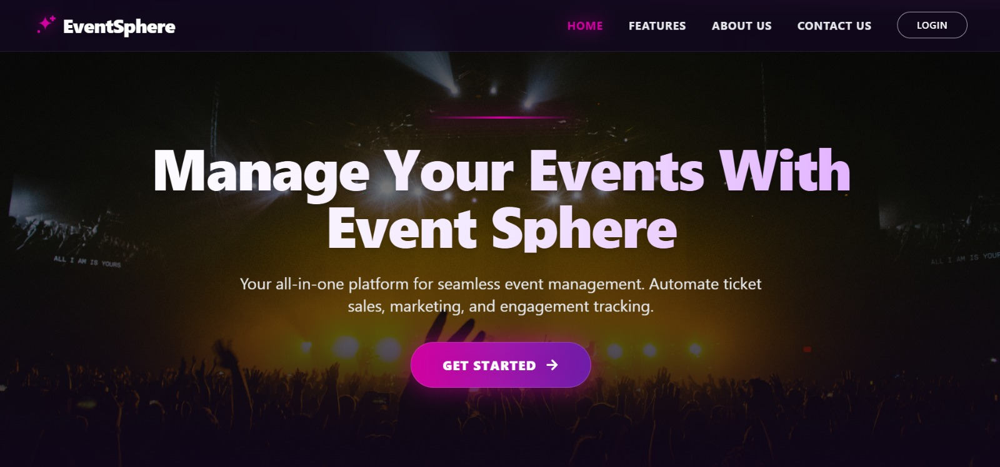
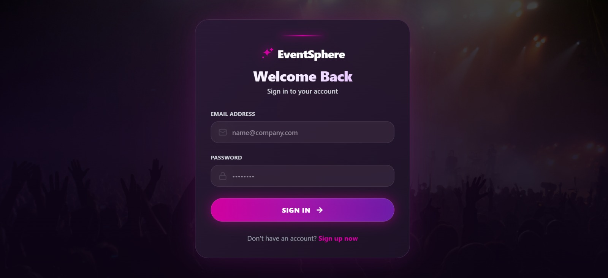
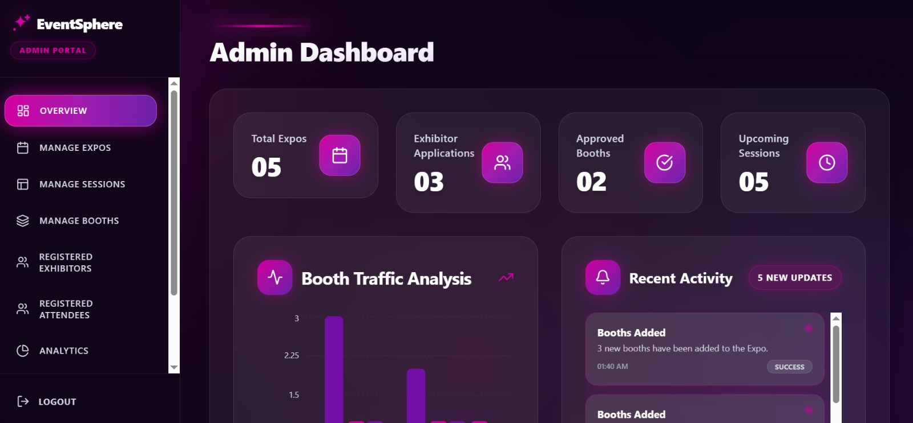
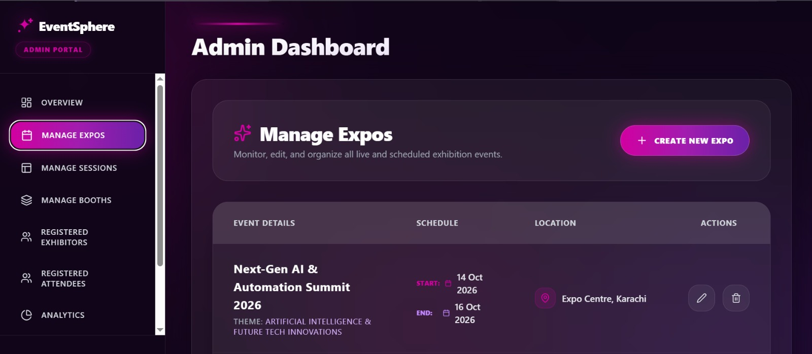
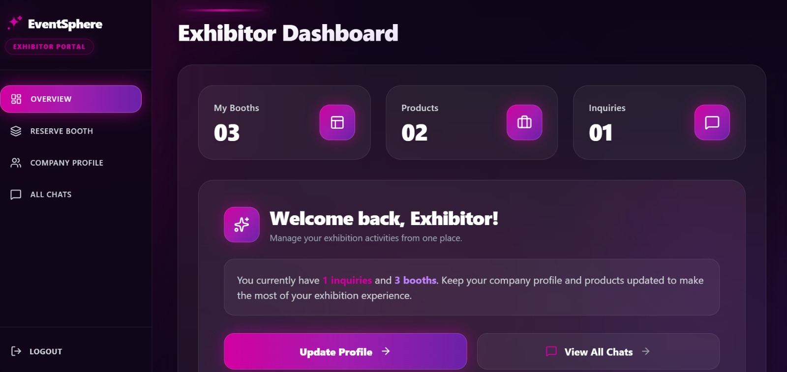
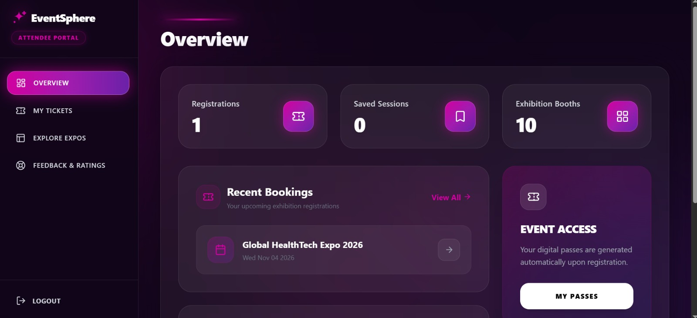
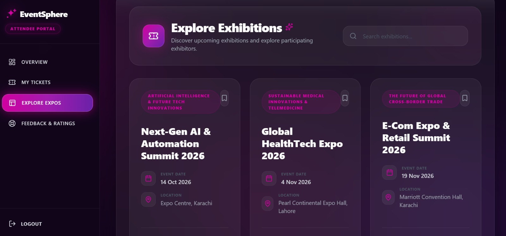
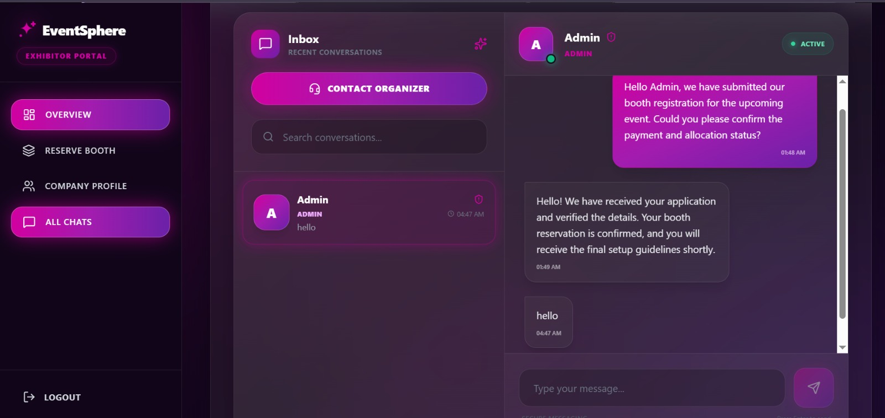

# EventSphere Management

A full-stack MERN web application for managing trade shows, exhibitions, and expos. EventSphere provides separate dashboards and workflows for **Admins, Exhibitors, and Attendees**, making expo management and participation easier through a centralized platform.

## 🚀 Live Demo

**Frontend:**
https://eventsphere-frontend-dun.vercel.app

**Backend API:**
https://eventsphere-backend-mocha.vercel.app

---

## 📸 Screenshots

### Home Page



### Login



### Admin Dashboard



### Manage Expo



### Exhibitor Dashboard



### Attendee Dashboard



### Explore Expos



### Contact Organizer



> Add your screenshots inside the `screenshots` folder using the same filenames referenced above.

---

## ✨ Features

### 👨‍💼 Admin

* Create and manage expos
* Configure exhibition booths
* Manage booth booking requests
* Approve or reject exhibitor requests
* Create and manage session schedules
* Review attendee feedback
* Monitor expo analytics
* Manage platform activities

### 🏢 Exhibitor

* Create and update company profile
* Showcase products and services
* Upload company assets and product images
* Request booth allocations
* Manage booth information
* Communicate with attendees and organizers

### 👤 Attendee

* Explore available expos
* Search and discover exhibitions
* Book expo tickets
* Generate scannable QR-code tickets
* Export tickets as PDF
* Bookmark sessions
* View expo information
* Chat with exhibitors and organizers

---

## 🛠️ Tech Stack

### Frontend

* React 19
* Vite
* Tailwind CSS
* PostCSS
* Framer Motion
* React Router
* React Context API
* Recharts
* Lucide React
* Axios

### Backend

* Node.js
* Express.js
* MongoDB
* Mongoose
* JWT Authentication
* Cloudinary
* Multer

### Deployment

* Vercel

---

## 📁 Project Structure

```text
EventSphere Management/
│
├── backend/
│   ├── controllers/
│   ├── models/
│   ├── routes/
│   ├── middleware/
│   ├── uploads/
│   ├── server.js
│   └── package.json
│
├── frontend/
│   ├── public/
│   ├── src/
│   │   ├── components/
│   │   ├── pages/
│   │   ├── context/
│   │   ├── assets/
│   │   └── ...
│   ├── package.json
│   └── vite.config.js
│
├── screenshots/
│   ├── home.jpeg
│   ├── login.jpeg
│   ├── admin-dashboard.jpeg
│   ├── manage-expo.jpeg
│   ├── exhibitor-dashboard.jpeg
│   ├── attendee-dashboard.jpeg
│   ├── explore-expos.jpeg
│   └── ticket.jpeg
│
├── .gitignore
├── LICENSE
└── README.md
```

---

## ⚙️ Installation & Setup

### 1. Clone the Repository

```bash
git clone <your-github-repository-url>
cd "Eventsphere Management"
```

### 2. Backend Setup

```bash
cd backend
npm install
```

Create a `.env` file in the backend folder and add your required environment variables.

Example:

```env
PORT=5000
MONGO_URI=your_mongodb_connection_string
JWT_SECRET=your_jwt_secret
CLOUDINARY_CLOUD_NAME=your_cloudinary_cloud_name
CLOUDINARY_API_KEY=your_cloudinary_api_key
CLOUDINARY_API_SECRET=your_cloudinary_api_secret
```

Start the backend:

```bash
npm run dev
```

The backend runs locally on:

```text
http://localhost:5000
```

### 3. Frontend Setup

Open another terminal:

```bash
cd frontend
npm install
```

Start the frontend:

```bash
npm run dev
```

The frontend will be available at the local Vite URL shown in your terminal.

---

## 🔐 Environment Variables

Environment files containing secrets are intentionally excluded from the repository.

Do **not** commit:

```text
.env
.env.*
```

Never expose sensitive credentials such as:

* MongoDB connection strings
* JWT secrets
* Cloudinary API secrets
* Other private API credentials

---

## ☁️ Deployment

The application is deployed using **Vercel**.

### Frontend

```text
https://eventsphere-frontend-dun.vercel.app
```

### Backend

```text
https://eventsphere-backend-mocha.vercel.app
```

---

## 🔄 Application Flow

```text
Admin
  │
  ├── Create Expo
  ├── Configure Booths
  ├── Manage Sessions
  ├── Approve Booth Requests
  └── Monitor Analytics
          │
          ▼
      EventSphere
          ▲
          │
  ┌───────┴────────┐
  │                │
Exhibitor       Attendee
  │                │
  ├─ Company       ├─ Explore Expos
  │  Profile       ├─ Book Tickets
  ├─ Products      ├─ QR Tickets
  ├─ Booth Request ├─ Bookmarks
  └─ Chat           └─ Chat
```

---

## 🎯 Purpose

EventSphere Management was developed as a full-stack web application to demonstrate practical implementation of:

* Role-based authentication
* REST APIs
* CRUD operations
* Database management
* File and image uploads
* Cloud storage integration
* Ticket generation
* QR-code functionality
* Real-time-style messaging
* Dashboard analytics
* Responsive UI design
* Full-stack deployment

---

## 📄 License

This project is protected by a custom **All Rights Reserved** license.

See the [LICENSE](LICENSE) file for details.

---

## 👩‍💻 Author

**Hafiza Maryam**

Full-Stack Web Developer

Built with React, Node.js, Express, and MongoDB.
